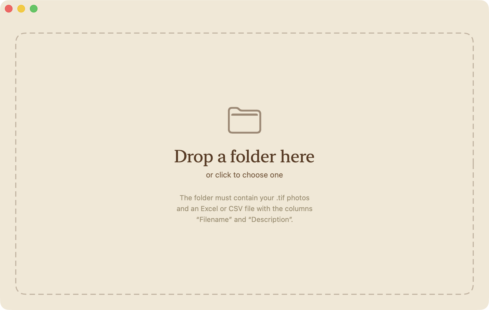

<p align="center">
  
</p>

<h1 align="center">Captioneer</h1>

<p align="center"><em>Pull the captions out of your photos.</em></p>

<p align="center">
  <a href="https://github.com/jerefrer/captioneer/releases/latest/download/Captioneer.dmg"><strong>Download for macOS</strong></a><br/>
  <sub>Apple Silicon · macOS 14 or later</sub>
</p>

<p align="center">
  
</p>

## How it works

1. **Gather** — pick your photos (`.tif`, `.jpg`, `.png`) or a whole folder.
2. **Drop** — drag them into Captioneer, or click to choose them.
3. **Done** — an `Extraction.xlsx` lands right next to them: filename and caption, ready to open in Excel.

For each photo, Captioneer takes the first caption it finds — `Description` (XMP), then `Caption-Abstract` (IPTC), then `ImageDescription` (EXIF), then `Title`. Multi-line and bilingual EN/FR captions are kept intact. Images are read only, never modified.

## Build from source

```bash
./build_app.sh            # build + sign + notarize → dist/Captioneer.dmg
./build_app.sh --no-sign  # quick local build, unsigned
```

---

<p align="center"><sub>By <a href="https://frerejeremy.me">Jérémy Frère</a></sub></p>
